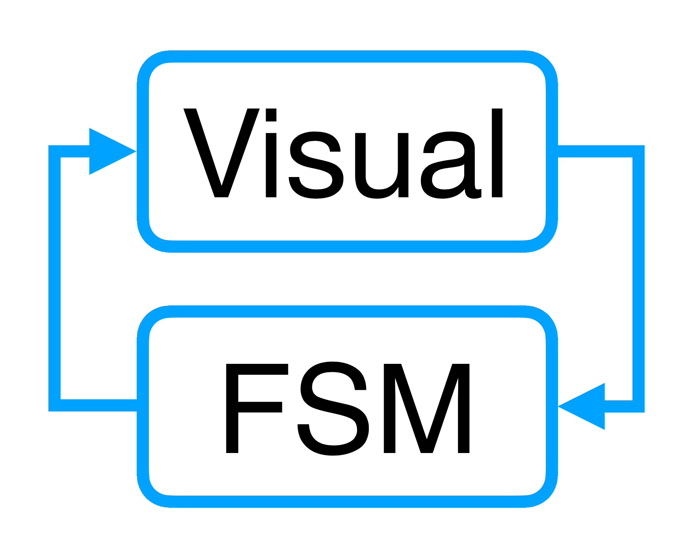
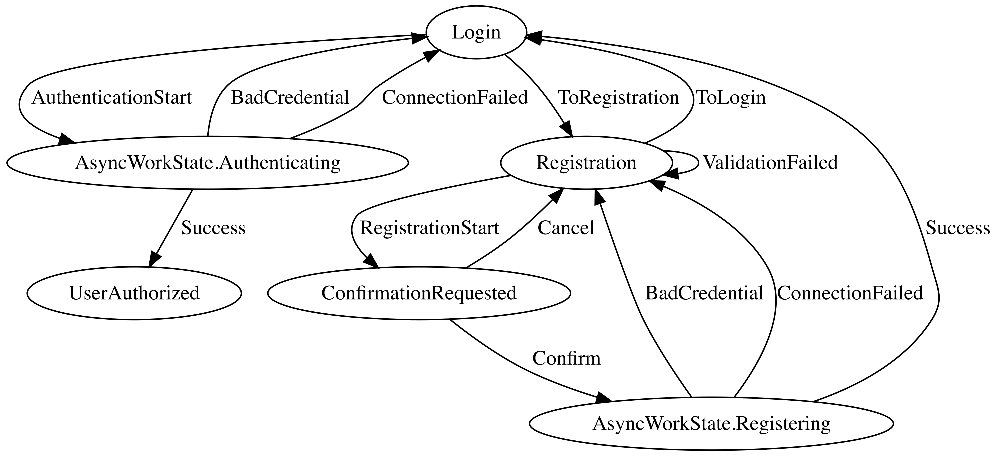
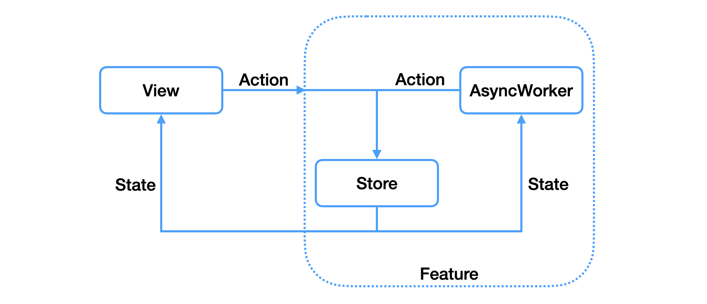

# 

[](https://search.maven.org/artifact/ru.kontur.mobile.visualfsm/visualfsm-core)
[](https://t.me/visualfsm)
[](https://t.me/visualfsm_support)

ENG | [RUS](docs/ru/README-RU.md)

`VisualFSM` is a Kotlin Multiplatform library for implements an **FSM**-based (`Finite-state machine`)[[2]](#what-is-fsm) **MVI** pattern
(`Model-View-Intent`)[[1]](#what-is-mvi) and a set of tools for visualization and analysis of **FSM**'s diagram of states.

The graph is being built from source code of **FSM**'s implementation. There is no need of custom
written configurations for **FSM**, you can just create new State and Action classes, they would be
automatically added to the graph of States and Transitions.

Source code analysis and the graph built are being performed with reflection and declared as a
separate module that would allow it to be connected to testing environment.

## Contents

[Overview of library modules](#overview-of-library-modules)

[Quickstart](#quickstart)

[VisualFSM Pros](#visualfsm-pros)

[Structure of VisualFSM](#structure-of-visualfsm)

[Samples of usage](#samples-of-usage)

## Overview of library modules

Base classes for Android, JVM and KMM projects (Feature and AsyncWorker coroutines edition)

```kotlin
implementation("ru.kontur.mobile.visualfsm:visualfsm-core:$visualfsmVersion")
```

Support of RxJava 3 (FeatureRx, AsyncWorkerRx and dependent classes)

```kotlin
implementation("ru.kontur.mobile.visualfsm:visualfsm-rxjava3:$visualfsmVersion")
```

Support of RxJava 2 (FeatureRx, AsyncWorkerRx and dependent classes)

```kotlin
implementation("ru.kontur.mobile.visualfsm:visualfsm-rxjava2:$visualfsmVersion")
```

Code generation

```kotlin
ksp("ru.kontur.mobile.visualfsm:visualfsm-compiler:$visualfsmVersion")
```

Classes for easy getting generated code

```kotlin
implementation("ru.kontur.mobile.visualfsm:visualfsm-providers:$visualfsmVersion")
```

Graph creation and analysis

```kotlin
testImplementation("ru.kontur.mobile.visualfsm:visualfsm-tools:$visualfsmVersion")
```

## Quickstart

See in [Quickstart](docs/Quickstart.md)

## VisualFSM Pros

### Visualization of FSM graph

Visualization lets you spend less time on understanding complex business process and makes it easier
for _debugging_, _adding new features_, and _refactoring old ones_.



A simplified FSM graph sample of user authorization and registration.

### Analysis

Validation on reachability for all states, on set of terminal states and lack of unexpected dead-end
states, custom graph checks in unit tests.

### Managing asynchronous operations

Every async work can be represented by separate states, because of this we can have a common set of
states that are lining up to a directed graph.

An AsyncWorker allows you to simplify the processing of states with asynchronous work.

## Structure of VisualFSM

The main entities are `State`, `Action`, `Transition`, `Feature`, `AsyncWorker`, `TransitionCallbacks`.

### State of VisualFSM

`State` is an interface to mark State classes.

### Action of VisualFSM

`Action` is a base class for action, used as an input object for FSM and describes the transition
rules to other states by `Transition` classes. A state is being selected depending of the current
FSM's `State` and provided predicate (the `predicate` function). There are two scenarios that would
say the transition rules were set wrong:

1. If there are several `Transition`s that would fit the specified conditions: a `State` the FSM was
   in is inside a `Transition` and a `predicate` returns `true` — there would be an error passed to
   a `TransitionCallbacks`, `onMultipleTransitionError` would be called, and the first
   suitable `Transition` would be executed.
2. In case no `Transtion` will do, an error would be passed to a `TransitionCallbacks`,
   `onNoTransitionError` would be called, and a `State` won't be changed.

### Transition of VisualFSM

`Transition` is a base transition class and is declared as an inner class in an `Action`. There must
be two generic `State`s for every `Transition`: a `State`, the one the transition is going from, and
a `State` that is going to be current for FSM after a `transofrm` execution.

For the inherited classes of `Transition` you need to override a `transform` method and
a `predicate` method, but `predicate` must be overridden only if you have more than one `Transition`
with similar start `State`s.

#### The predicate and transform functions of Transition

* `predicate` describes the conditions of a `Transition`'s choice depending on input data that was
  passed to an `Action`'s constructor. It is a one of conditions for the choice of `Transition`. The
  first condition is that the current `State` has to be the same as the `Transition`'s start `State`
  which was specified in generic. You might not to override `predicate` if you don't have more than
  one `Transition` with matching start `State`s.
* `transform` creates a new `State` for a `Transition`.

### AsyncWorker of VisualFSM



`AsyncWorker` controls the start and stop of async tasks. `AsyncWorker` starts async requests or
stops them it it gets specified `State` via a subscription. As long as the request completes with
either success or error, the `Action` will be called and the FSM will be set with a new `State`. For
convenience those states that are responsible for async tasks launch, it is recommended to join them
in `AsyncWorkState`.

To subscribe to `State`, you need to override the `onNextState` method, and for each state to construct 
AsyncWorkerTask for processing in the AsyncWorker.
For each operation result (success and error) you must call the proceed method and pass `Action` to handle the result.
Don't forget to handle each task's errors in `onNextState` method, if an unhandled exception occurs,
then fsm may stuck in the current state and the onStateSubscriptionError method will be called.

There might be a case when we can get a `State` via a subscription that is fully equivalent to
current running async request, so for this case there are two type of AsyncWorkTask:

* AsyncWorkerTask.ExecuteIfNotExist - launch only if operation with equals state is not currently running (priority is
  given to a running operation with equals state object)
* AsyncWorkerTask.ExecuteIfNotExistWithSameClass - launch only if operation with same state class is not currently running (priority is
  given to a running operation with same state class, used for tasks that deliver the result in several stages)
* AsyncWorkerTask.ExecuteAndCancelExist - relaunch async work (priority is for the new on).

To handle a state change to state without async work, you must use a task:

* AsyncWorkerTask.Cancel - stop asynchronous work, if running

### Feature of VisualFSM

`Feature` is the facade for FSM, provides subscription on current `State`, and
proceeds incoming `Action`s.

### TransitionCallbacks of VisualFSM

`TransitionCallbacks` gives access to method callbacks for third party logic. They are great for
_logging_, _debugging_, _metrics_, etc. on five available events: when `Action` is launched,
when `Transition` is selected, a new `State` had been reduced, and two error events —
no `Transition`s or multiple `Transition`s available.

### Tools of VisualFSM

- `VisualFSM.generateDigraph(...): String` - generate a FSM DOT graph for visualization in Graphviz (graphviz cli on CI or http://www.webgraphviz.com/ in browser), use the `useTransitionName` argument to set the `Transition` or `Action` class name as the edge name, or the `@Edge("name")` annotation on the `Transition` class to set a custom edge name

- `VisualFSM.getUnreachableStates(...): List<KClass<out STATE>>` - get all unreachable states from initial state 

- `VisualFSM.getFinalStates(...): List<KClass<out STATE>>` - get all final states

- `VisualFSM.getEdgeListGraph(...): List<Triple<KClass<out STATE>, KClass<out STATE>, String>>` - builds an Edge List

- `VisualFSM.getAdjacencyMap(...): Map<KClass<out STATE>, List<KClass<out STATE>>>` - builds an Adjacency Map of states

## Samples of usage
#### [Android app (Kotlin Coroutines, Jetpack Compose)](https://github.com/Kontur-Mobile/VisualFSM-Sample-Android)
#### [KMM (Android + iOS) app (Kotlin Coroutines, Jetpack Compose, SwiftUI)](https://github.com/Kontur-Mobile/VisualFSM-Sample-KMM)
#### [Command line app Kotlin (Kotlin Coroutines)](https://github.com/Kontur-Mobile/VisualFSM-Sample-CLI/tree/main/cli-sample)
#### [Command line app Kotlin (RxJava)](https://github.com/Kontur-Mobile/VisualFSM-Sample-CLI/tree/main/cli-sample-rx)

A tests sample for FSM of user authorization and
registration: [AuthFSMTests.kt](https://github.com/Kontur-Mobile/VisualFSM-Sample-Android/blob/main/app/src/test/java/ru/kontur/mobile/visualfsm/sample_android/AuthFSMTests.kt)

The DOT visualization graph for graphviz is being generated using the `VisualFSM.generateDigraph(...)` method.

For CI visualization use [graphviz](https://graphviz.org/doc/info/command.html), for the local visualization (on your
PC) use [webgraphviz](http://www.webgraphviz.com/).

<h3 id="AuthFeature.kt">AuthFeature.kt</h3>

```kotlin
    // Use Feature with Kotlin Coroutines or FeatureRx with RxJava
@GenerateTransitionsFactory // Use this annotation for generation TransitionsFactory
class AuthFeature(initialState: AuthFSMState) : Feature<AuthFSMState, AuthFSMAction>(
    initialState = initialState,
    asyncWorker = AuthFSMAsyncWorker(AuthInteractor()),
    transitionCallbacks = TransitionCallbacksImpl(), // Tip - use DI
    transitionsFactory = provideTransitionsFactory(), // Get an instance of the generated TransitionsFactory
    // Getting an instance of a generated TransitionsFactory for KMM projects:
    // Name generated by mask Generated[FeatureName]TransitionsFactory()
    // transitionsFactory = GeneratedAuthFeatureTransitionsFactory(), // Until the first start of code generation, the class will not be visible in the IDE.
)

val authFeature = AuthFeature(
    initialState = AuthFSMState.Login("", "")
)

// Observe states on Feature
authFeature.observeState().collect { state -> }

// Observe states on FeatureRx
authFeature.observeState().subscribe { state -> }

// Proceed Action
authFeature.proceed(Authenticate("", ""))
```

### AuthFSMState.kt

All `State`s are listed in a sealed class. For the convenience `State`s that call async work is
recommended to group inside inner `AsyncWorkState` sealed class.

```kotlin
sealed class AuthFSMState : State {
    data class Login(
        val mail: String,
        val password: String,
        val errorMessage: String? = null
    ) : AuthFSMState()

    data class Registration(
        val mail: String,
        val password: String,
        val repeatedPassword: String,
        val errorMessage: String? = null
    ) : AuthFSMState()

    data class ConfirmationRequested(
        val mail: String,
        val password: String
    ) : AuthFSMState()

    sealed class AsyncWorkState : AuthFSMState() {
        data class Authenticating(
            val mail: String,
            val password: String
        ) : AsyncWorkState()

        data class Registering(
            val mail: String,
            val password: String
        ) : AsyncWorkState()
    }

    data class UserAuthorized(val mail: String) : AuthFSMState()
}
```

### AuthFSMAsyncWorker.kt

AsyncWorker subscribes on state changes, starts async tasks for those in `AsyncWorkState` group, and
calls `Action` to process the result after the async work is done.

```kotlin
class AuthFSMAsyncWorker(private val authInteractor: AuthInteractor) : AsyncWorker<AuthFSMState, AuthFSMAction>() {
    override fun onNextState(state: AuthFSMState): AsyncWorkerTask<AuthFSMState> {
        return when (state) {
            is AsyncWorkState.Authenticating -> {
                AsyncWorkerTask.ExecuteAndCancelExist(state) {
                    val result = authInteractor.check(state.mail, state.password)
                    proceed(HandleAuthResult(result))
                }
            }
            is AsyncWorkState.Registering -> {
                AsyncWorkerTask.ExecuteIfNotExist(state) {
                    val result = authInteractor.register(state.mail, state.password)
                    proceed(HandleRegistrationResult(result))
                }
            }
            else -> AsyncWorkerTask.Cancel()
        }
    }
}
```

### HandleRegistrationResult.kt

`HandleRegistrationResult` is one of `Action`s of the sample authorization and registration FSM that
is called from `AsyncWorker` after the result of registration is received. It consists of
two `Transition`s, the necessary `Transition` is chosen after `predicate` function result.

```kotlin
class HandleRegistrationResult(val result: RegistrationResult) : AuthFSMAction() {

    inner class Success : Transition<AsyncWorkState.Registering, Login>() {
        override fun predicate(state: AsyncWorkState.Registering) =
            result == RegistrationResult.SUCCESS

        override fun transform(state: AsyncWorkState.Registering): Login {
            return Login(state.mail, state.password)
        }
    }

    inner class BadCredential : Transition<AsyncWorkState.Registering, Registration>() {
        override fun predicate(state: AsyncWorkState.Registering) =
            result == RegistrationResult.BAD_CREDENTIAL

        override fun transform(state: AsyncWorkState.Registering): Registration {
            return Registration(state.mail, state.password, "Bad credential")
        }
    }

    inner class ConnectionFailed : Transition<AsyncWorkState.Registering, Registration>() {
        override fun predicate(state: AsyncWorkState.Registering) =
            result == RegistrationResult.NO_INTERNET

        override fun transform(state: AsyncWorkState.Registering): Registration {
            return Registration(state.mail, state.password, state.password, "No internet")
        }
    }
}
```


### AuthFSMTests.kt

```kotlin

class AuthFSMTests {

    @Test
    fun generateDigraph() {
        println(
            VisualFSM.generateDigraph(
                baseAction = AuthFSMAction::class,
                baseState = AuthFSMState::class,
                initialState = AuthFSMState.Login::class,
            )
        )
        Assertions.assertTrue(true)
    }

    @Test
    fun allStatesReachableTest() {
        val notReachableStates = VisualFSM.getUnreachableStates(
            baseAction = AuthFSMAction::class,
            baseState = AuthFSMState::class,
            initialState = AuthFSMState.Login::class,
        )

        Assertions.assertTrue(
            notReachableStates.isEmpty(),
            "FSM have unreachable states: ${notReachableStates.joinToString(", ")}"
        )
    }

    @Test
    fun oneFinalStateTest() {
        val finalStates = VisualFSM.getFinalStates(
            baseAction = AuthFSMAction::class,
            baseState = AuthFSMState::class,
        )

        Assertions.assertTrue(
            finalStates.size == 1 && finalStates.contains(AuthFSMState.UserAuthorized::class),
            "FSM have not correct final states: ${finalStates.joinToString(", ")}"
        )
    }
}
```


## What is MVI

`MVI` stands for **Model-View-Intent**. It is an architectural pattern that utilizes _unidirectional
data flow_. The data circulates between `Model` and `View` only in one direction - from `Model`
to `View` and from `View` to `Model`.

[More on hannesdorfmann](http://hannesdorfmann.com/android/model-view-intent/)

## What is FSM

A `finite-state machine` (FSM) is an abstract machine that can be in exactly one of a finite number
of states at any given time. The `FSM` can change from one state to another in response to some
inputs.

[More on wikipedia](https://en.wikipedia.org/wiki/Finite-state_machine)