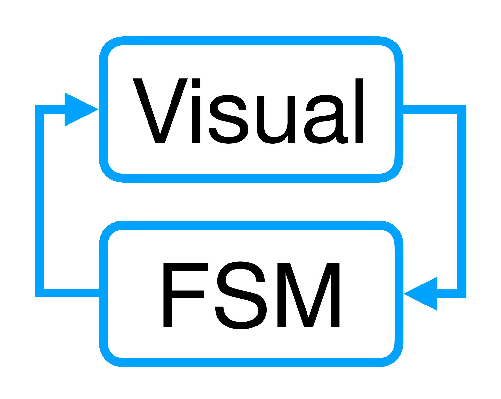

# 

[](https://search.maven.org/artifact/ru.kontur.mobile.visualfsm/visualfsm-core)
[](https://t.me/visualfsm)
[](https://t.me/visualfsm_support)

ENG | [RUS](./ru/ExternalStateSource-RU.md)

### External state sources (optional)
The ability to interact between Features via a common state source is optional,
this can be useful for interaction between Features via shared state
or to work with other state-based frameworks.

One option for interaction between parent and child Features is to use
a single state tree, while a child Feature can read and manage only its state branch,
and the state of the parent Feature will always include the current state of the child Feature.

In this way, a single source of truth is realized between multiple Features.

To implement such interaction, you need to pass the implementation of IStateSource to the constructor of the child Feature
(or IStateSourceRx if you are using RxJava to work asynchronously)

```kotlin
interface IStateSource<STATE : State> {

    /**
     * Provides a [flow][StateFlow] of [states][State]
     *
     * @return a [flow][StateFlow] of [states][State]
     */
    fun observeState(): StateFlow<STATE>

    /**
     * Returns current state
     *
     * @return current [state][State]
     */
    fun getCurrentState(): STATE

    /**
     * Update current state
     *
     * @param newState [State] for update
     */
    fun updateState(newState: STATE)
}
```

Example implementation of IStateSource
```kotlin
class ChildStateSource @Inject constructor(
    private val parentFeature: ParentFeature,
) : IStateSource<ChildFSMState> {

    override fun observeState(): StateFlow<ChildFSMState> {
        return parentFeature.observeState().mapNotNull { (it as? ParentFSMState.StateWithChildStateField)?.childState }
    }

    override fun getCurrentState(): ChildFSMState {
        return (parentFeature.getCurrentState() as ParentFSMState.StateWithChildStateField).childState
    }

    override fun updateState(newState: ChildFSMState) {
        // the updateChildState method of the parent Feature calls an Action in which the childState field of the state of the parent Feature
        parentFeature.updateChildState(newState)
    }
}
```

In the parent Feature, if it is the root there is no need to pass an external implementation of IStateSource