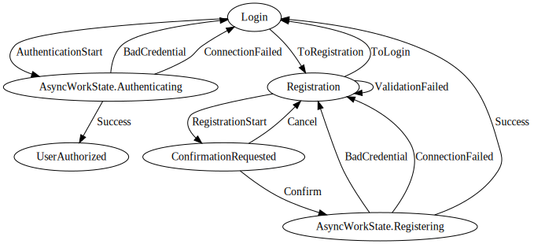

# VisualFSM

[ENG](../README.md) | RUS

`VisualFSM` – это Kotlin-библиотека для реализации **MVI-архитектуры**
(`Model-View-Intent`)[[1]](#что-такое-mvi) и набор инструментов для визуализации и анализа диаграммы
состояний **конечного автомата** (`Finite-state machine`, далее FSM)[[2]](#что-такое-fsm).

Визуализация происходит по исходному коду реализации FSM. Не требует написания отдельных
конфигураторов для FSM, достаточно добавлять новые классы `State` и `Action` – они автоматически
добавятся в граф состояний и переходов FSM.

Анализ исходного кода и построение графа выполняется с помощью рефлексии и реализован отдельным
модулем, что позволяет подключить его только к тестовой среде.

## Как подключить

Базовые классы, JVM и KMM версия

```kotlin
implementation('ru.kontur.mobile.visualfsm:visualfsm-core:1.0.0')
```

Поддержка RxJava (FeatureRx, AsyncWorkerRx и их зависимости)

```kotlin
implementation('ru.kontur.mobile.visualfsm:visualfsm-rx:1.0.0')
```

Инструменты для анализа и построения графа

```kotlin
testImplementation('ru.kontur.mobile.visualfsm:visualfsm-tools:1.0.0')
```

## Плюсы VisualFSM

### Визуализация графа FSM

Визуализация позволяет тратить меньше времени на понимание сложного бизнес процесса и упрощает
_поиск ошибок_, _добавление нового функционала_ и _рефакторинг_.



Упрощенный пример графа FSM авторизации и регистрации пользователя

### Анализ

Проверка на достижимость всех состояний, проверка множества терминальных состояний и отсутствия
незапланированных тупиковых состояний, кастомные проверки графа в unit-тестах.

### Управление асинхронными операциями

Асинхронная работа может быть представлена отдельными состояниями – благодаря этому мы имеем единый
набор состояний, которые выстраиваются в направленный граф. 
Объект AsyncWorker позволяет упростить обработку состояний в которых выполняется асинхронная работа. 

## Структура VisualFSM

Основные сущности, которые используются, – `State`, `Action`, `Transition`, `Feature`, `AsyncWorker`, `TransitionCallbacks`.

### State в VisualFSM

`State` – интерфейс-метка для обозначения классов состояний.

### Action в VisualFSM

`Action` — базовый класс действия, является входным объектом для FSM и описывает правила переходов в
другие состояния, используя классы `Transition`. В зависимости от текущего `State` у FSM и заданного
предиката, функции `predicate`, выбирается `State`, в который нужно перейти. Есть два ошибочных
сценария, символизирующие о том, что правила перехода описаны некорректно:

1. Если есть несколько `Transition`, которые подоходят под заданные условия: в `Transition` указан
   `State`, в котором находился FSM, и `predicate` возвращает значение true, в `TransitionCallbacks`
   будет передана ошибка, будет вызван `onMultipleTransitionError`, и выполнится первый
   подходящий `Transition`.
2. В случае если не подойдет ни один из указанных `Transition`, то в `TransitionCallbacks` будет
   передана ошибка, будет вызван `onNoTransitionError`, а `State` останется неизмененным.

### Transition в VisualFSM

`Transition` — базовый класс перехода, реализуется как inner class в `Action`. Для
каждого `Transition` нужно указать два generic параметра типа `State`: `State`, из которого
происходит переход, и `State`, в котором будет находиться FSM после отработки `transform`.

Классам наследникам `Transition` необходимо реализовать функцию `transform`, а при наличии ветвления
переопределить функцию `predicate`.

#### Функции predicate и transform у Transition

* `predicate` описывает условие выбора `Transition` на основе входных данных (переданных в
  конструктор `Action`), является одним из условий выбора `Transition`. Первым условием является
  совпадение текущего состояния со стартовым для `Transition`, указанным в generic. Если нет
  нескольких `Transition` с совпадающим стартовым `State`, `predicate` можно не переопределять
* `transform` конструирует новое состояние для выполнения перехода.

### AsyncWorker в VisualFSM

`AsyncWorker` управляет запуском и остановкой асинхронной работы. `AsyncWorker` запускает
асинхронный запрос или останавливает его, если ему по подписке придёт соответствующий `State`. Как
только запрос завершится успешно или с ошибкой, результат необходимо передать в FSM вызвав `Action`,
и в FSM будет установлен новый `State`. Для удобства состояния, которые запускают какую-либо асинхронную работу,
рекомендуется объединять в родительский `AsyncWorkState`, так эти состояния будет зрительно проще
выявлять на диаграмме состояний.

Для подписки на `State` необходимо переопределить метод `onNextState`, в котором на каждое 
входящее состояние сконструировать подходящий AsyncWorkerTask для обработки в AsyncWorker.
По окончании каждой операции успешно или с ошибкой, необходимо вызвать proceed метод и передать
`Action` обработки результата.
Не забудьте обработать ошибки каждой задачи в этом методе, если возникает необработанное исключение,
то fsm может зависнуть в текущем состоянии и будет вызван метод `onStateSubscriptionError`.

Для обработки сценария в котором по подписке пришёл `State`, в точности эквивалентный уже работающему
асинхронному запросу, необходимо выбрать подходящий тип задачи:

* AsyncWorkerTask.ExecuteIfNotExist - запустить, только если эквивалентная операция в данный момент не выполняется (
  приоритет выполняющейся)
* AsyncWorkerTask.ExecuteAndCancelExist - перезапустить асинхронную операцию (приоритет новой).

Для обработки смены состояния на состояние без асинхронной работы, необходимо использовать задачу:

* AsyncWorkerTask.Cancel - остановить асинхронную операцию если есть активная.


### Feature в VisualFSM

`Feature` — фасад к FSM, предоставляет подписку на `State` и принимает `Action` для обработки.

### TransitionCallbacks в VisualFSM

`TransitionCallbacks` предоставляет обратные вызовы для сторонней логики. Их удобно использовать для
_логгирования_, _бизнес метрик_, _отладки_ и другого с использованием пяти доступных ивентов:
когда `Action` запускается, когда `Transition` выбран, новый `State` был создан, и двух ошибок —
когда нет доступных `Transition` или когда доступно несколько `Transition`.

## Пример использования

Пример реализации FSM авторизации и регистрации пользователя: [sample](../sample).

Пример тестов для FSM авторизации и регистрации: [AuthFSMTests.kt](../sample/src/test/kotlin/ru/kontur/mobile/visualfsm/AuthFSMTests.kt).

Построение графа в формате DOT для graphviz выполняется с помощью метода `VisualFSM.generateDigraph(...)`

Для визуализации на CI используйте утилиту [graphviz](https://graphviz.org/doc/info/command.html), для визуализации на компьютере разработчика используйте [webgraphviz](http://www.webgraphviz.com/). 


### AuthFeature

```kotlin
    // Используйте Feature для Kotlin Coroutines или FeatureRx для RxJava
    class AuthFeature(initialState: AuthFSMState) : Feature<AuthFSMState, AuthFSMAction>(
        initialState = initialState,
        asyncWorker = AuthFSMAsyncWorker(AuthInteractor()),
        transitionCallbacks = TransitionCallbacksImpl() // Совет - используйте DI
    )
    
    val authFeature = AuthFeature(
        initialState = AuthFSMState.Login("", "")
    )

    // Подписка на состояния в Feature
    authFeature.observeState().collect {state -> }

    // Подписка на состояния в FeatureRx
    authFeature.observeState().subscribe {state -> } 

    // Выполнение Action
    authFeature.proceed(Authenticate("", ""))
```

### AuthFSMState.kt

Все `State` указываются в sealed-классе. Для удобства, состояния, для которых должна выполняться
асинхронная работа — рекомендуется сгруппировать в sealed class `AsyncWorkState`.

```kotlin
sealed class AuthFSMState : State {
    data class Login(
        val mail: String,
        val password: String,
        val errorMessage: String? = null
    ) : AuthFSMState()

    data class Registration(
        val mail: String,
        val password: String,
        val repeatedPassword: String,
        val errorMessage: String? = null
    ) : AuthFSMState()

    data class ConfirmationRequested(
        val mail: String,
        val password: String
    ) : AuthFSMState()

    sealed class AsyncWorkState : AuthFSMState() {
        data class Authenticating(
            val mail: String,
            val password: String
        ) : AsyncWorkState()

        data class Registering(
            val mail: String,
            val password: String
        ) : AsyncWorkState()
    }

    data class UserAuthorized(val mail: String) : AuthFSMState()
}
```

### AuthFSMAsyncWorker.kt

`AsyncWorker` подписывается на изменения состояний, для входящих в группу `AsyncWorkState` запускает
асинхронную работу, по окончании асинхронной работы вызывает `Action` для обработки результата.

```kotlin
class AuthFSMAsyncWorker(private val authInteractor: AuthInteractor) : AsyncWorker<AuthFSMState, AuthFSMAction>() {
    override fun onNextState(state: AuthFSMState): AsyncWorkerTask<AuthFSMState> {
        return when (state) {
            is AsyncWorkState.Authenticating -> {
                AsyncWorkerTask.ExecuteAndCancelExist(state) {
                    val result = authInteractor.check(state.mail, state.password)
                    proceed(HandleAuthResult(result))
                }
            }
            is AsyncWorkState.Registering -> {
                AsyncWorkerTask.ExecuteIfNotExist(state) {
                    val result = authInteractor.register(state.mail, state.password)
                    proceed(HandleRegistrationResult(result))
                }
            }
            else -> AsyncWorkerTask.Cancel()
        }
    }
}
```

### HandleRegistrationResult.kt

`HandleRegistrationResult` — один из `Action` для демонстрационного примера FSM авторизации и
регистрации, вызываемый из `AsyncWorker` после получения результата регистрации. Состоит из
двух `Transition`, нужный `Transition` выбирается согласно результату выполнения `predicate`.

```kotlin
class HandleRegistrationResult(val result: RegistrationResult) : AuthFSMAction() {

    inner class Success : AuthFSMTransition<AsyncWorkState.Registering, Login>(
        AsyncWorkState.Registering::class,
        Login::class
    ) {
        override fun predicate(state: AsyncWorkState.Registering) =
            result == RegistrationResult.SUCCESS

        override fun transform(state: AsyncWorkState.Registering): Login {
            return Login(state.mail, state.password)
        }
    }

    inner class BadCredential : AuthFSMTransition<AsyncWorkState.Registering, Registration>(
        AsyncWorkState.Registering::class,
        Registration::class
    ) {
        override fun predicate(state: AsyncWorkState.Registering) =
            result == RegistrationResult.BAD_CREDENTIAL

        override fun transform(state: AsyncWorkState.Registering): Registration {
            return Registration(state.mail, state.password, "Bad credential")
        }
    }

    inner class ConnectionFailed : AuthFSMTransition<AsyncWorkState.Registering, Registration>(
        AsyncWorkState.Registering::class,
        Registration::class
    ) {
        override fun predicate(state: AsyncWorkState.Registering) =
            result == RegistrationResult.NO_INTERNET

        override fun transform(state: AsyncWorkState.Registering): Registration {
            return Registration(state.mail, state.password, state.password, "No internet")
        }
    }

    override val transitions = listOf(
        Success(),
        BadCredential(),
        ConnectionFailed(),
    )
}
```

### AuthFSMTests.kt

```kotlin

class AuthFSMTests {

    @Test
    fun generateDigraph() {
        println(
            VisualFSM.generateDigraph(
                baseAction = AuthFSMAction::class,
                baseState = AuthFSMState::class,
                initialState = AuthFSMState.Login::class,
            )
        )
        Assertions.assertTrue(true)
    }

    @Test
    fun allStatesReachableTest() {
        val notReachableStates = VisualFSM.getUnreachableStates(
            baseAction = AuthFSMAction::class,
            baseState = AuthFSMState::class,
            initialState = AuthFSMState.Login::class,
        )

        Assertions.assertTrue(
            notReachableStates.isEmpty(),
            "FSM have unreachable states: ${notReachableStates.joinToString(", ")}"
        )
    }

    @Test
    fun oneFinalStateTest() {
        val finalStates = VisualFSM.getFinalStates(
            baseAction = AuthFSMAction::class,
            baseState = AuthFSMState::class,
        )

        Assertions.assertTrue(
            finalStates.size == 1 && finalStates.contains(AuthFSMState.UserAuthorized::class),
            "FSM have not correct final states: ${finalStates.joinToString(", ")}"
        )
    }
}
```

## Что такое MVI

`MVI` расшифровывается как **Model-View-Intent**. Это архитектурный паттерн, который следует подходу
_однонаправленный поток данных_ (_unidirectional data flow_). Данные передаются от `Model`
к `View` только в одном направлении.

[Подробнее на hannesdorfmann](http://hannesdorfmann.com/android/model-view-intent/)

## Что такое FSM

`FSM` — это абстрактная сущность, которая может находиться только в одном из конечного количества
состояний в определённый момент. Она может переходить из одного состояния в другой в ответ на
входные данные.

[Подробнее на wikipedia](https://en.wikipedia.org/wiki/Finite-state_machine)